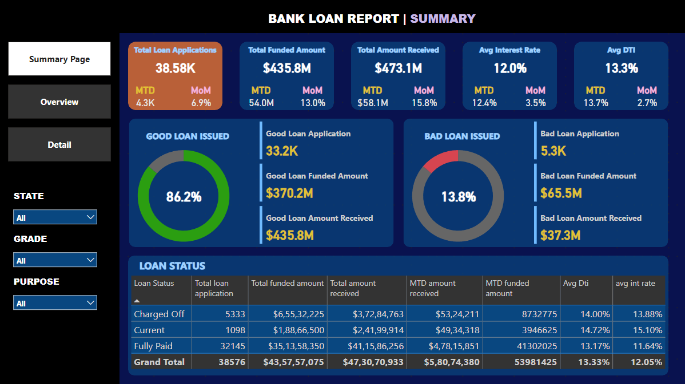
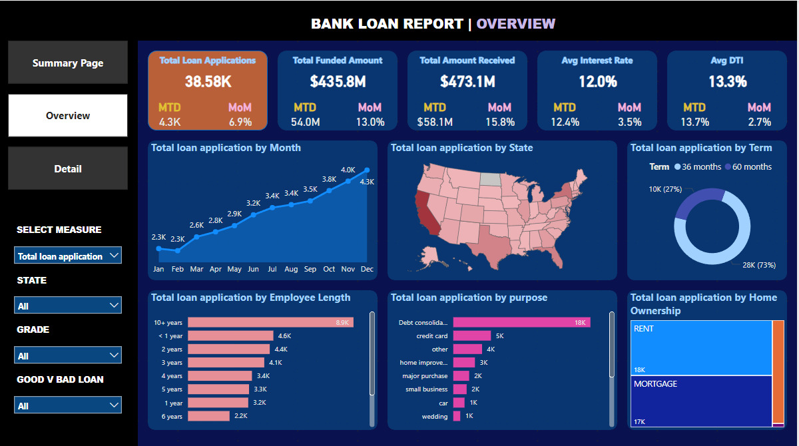
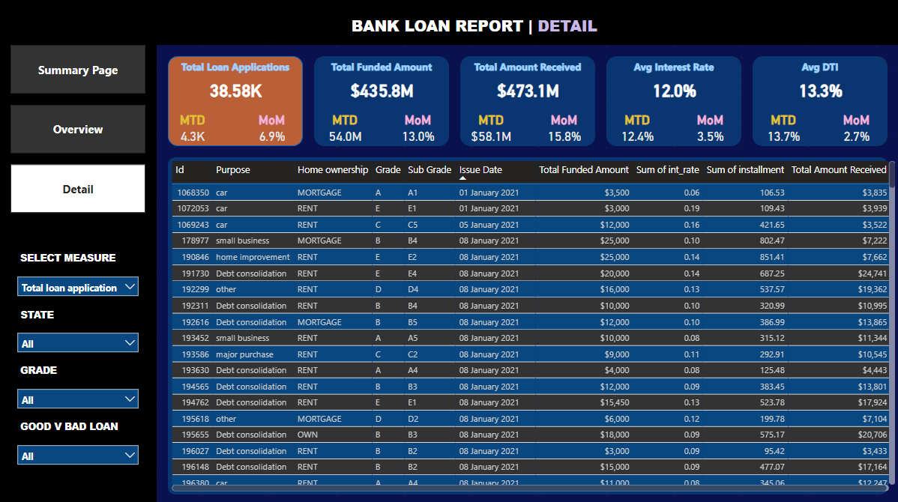

# Project Overview

*This project uses SQL for data extraction and Power BI for visualization to analyze lending metrics like loan applications and funded amounts. It provides insights into trends, regional disparities, and borrower characteristics to assess loan performance.*

-------------------------------------------------------------------------------------------------------------------------------------------------
## Data and Exploration

### - Dataset  

The database **`ig_clone`** is created using SQL.  
There are 7 tables: *Users, Photos, Likes, Comments, Follows, Tags, Photo Tags*.

### - Exploration Questions  
 
**The following questions are explored in this case study:**

-Total Loan Applications: What is the total number, MTD, and MoM change in loan applications?

- Total Loan Applications: Total, MTD, and MoM changes.
- Total Funded Amount: Total, MTD, and MoM changes.
- Total Amount Received: Total, MTD, and MoM changes.
- Average Interest Rate: Average, MTD, and MoM variations.
- Average Debt-to-Income Ratio (DTI): Average, MTD, and MoM fluctuations.
- Monthly Trends by Issue Date: Seasonality and long-term trends.
- Regional Analysis by State: Significant lending activity and regional disparities.
- Loan Term Analysis: Distribution of loans by term length.
- Employee Length Analysis: Lending metrics by employment length.
- Loan Purpose Breakdown: Metrics by loan purpose.
- Home Ownership Analysis: Impact of home ownership on loans.

-------------------------------------------------------------------------------------------------------------------------------------------------

